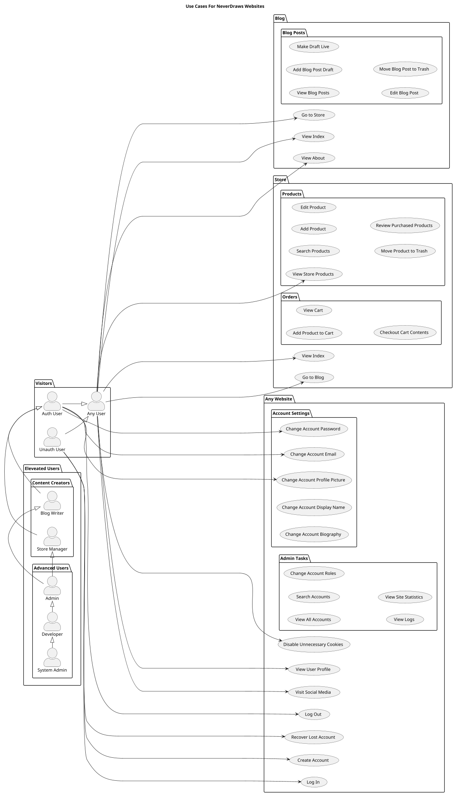

```puml
@startuml
left to right direction
skinparam actorStyle awesome
scale 0.8

title Use Cases For NeverDraws Websites

' Users
package Visitors {
	:Any User: as Any
	:Unauth User: as Unauth
	:Auth User: as Auth
}
package "Eleveated Users" {
	package "Content Creators" {
		:Blog Writer: as Blogger
		:Store Manager: as StoreManager
	}
	package "Advanced Users" {
		:Admin: as Admin
		:Developer: as Dev
		:System Admin: as SysAdmin
	}
}

' Websites
package "Any Website" {
	(Log In) as any000
	(Log Out) as any001
	(Recover Lost Account) as any002
	(Create Account) as any003
	(View User Profile) as any004
	(Visit Social Media) as any005
	(Disable Unnecessary Cookies) as any006
	package "Account Settings" {
		(Change Account Password) as any100
		(Change Account Email) as any101
		(Change Account Profile Picture) as any102
		(Change Account Display Name) as any103
		(Change Account Biography) as any104
	}
	package "Admin Tasks" {
		(View All Accounts) as any200
		(Search Accounts) as any201
		(Change Account Roles) as any202
		(View Logs) as any203
		(View Site Statistics) as any204
	}
}
package "Blog" {
	(View Index) as blog000
	(View About) as blog001
	(Go to Store) as blog002
	package "Blog Posts" {
		(View Blog Posts) as blog100
		(Add Blog Post Draft) as blog101
		(Make Draft Live) as blog102
		(Edit Blog Post) as blog103
		(Move Blog Post to Trash) as blog104
	}
}
package "Store" {
	(View Index) as store000
	(Go to Blog) as store001
	package "Products" {
		(View Store Products) as store100
		(Search Products) as store101
		(Add Product) as store102
		(Edit Product) as store203
		(Move Product to Trash) as store204
		(Review Purchased Products) as store205
	}
	package "Orders" {
		(Add Product to Cart) as store200
		(View Cart) as store201
		(Checkout Cart Contents) as store202
	}
}

' User Hierarchy
Any <|-u- Unauth
Any <|-u- Auth
Blogger -r-|> Auth
StoreManager -r-|> Auth
Admin --r-|> Blogger
Admin --r-|> StoreManager
Dev -|> Admin
SysAdmin -|> Dev

' User Use Case Relationships
Any ----------> any004
Any ----------> any005
Any ----------> any006
Any ----------> blog000
Any ----------> blog001
Any ----------> blog002
Any ----------> store000
Any ----------> store001
Any ----------> store100
Unauth ----------> any000
Unauth ----------> any002
Unauth ----------> any003
Auth ----------> any001
Auth ----------> any100
Auth ----------> any101
Auth ----------> any102

' Page Layout
Unauth -[hidden] Auth

@enduml
```
